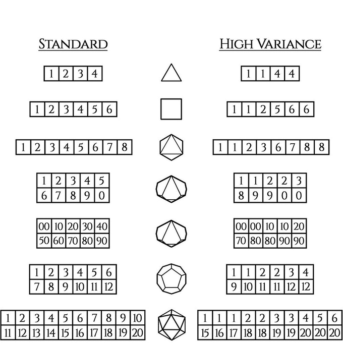

These functions define the Wyrmwood High Variance [dice](https://www.kickstarter.com/projects/wyrmwood/dice-by-wyrmwood). These dice maintain the same average roll as "standard" Dungeons and Dragons dice, but they have individual values skewed towards higher or lower rolls.

These dice are intended for "do or die" situations, where the party will either succeed or fail in heroic fashion.

In order to use the functions:
    `janus [d4|d6|d8|d10|d12|d20|d100]`